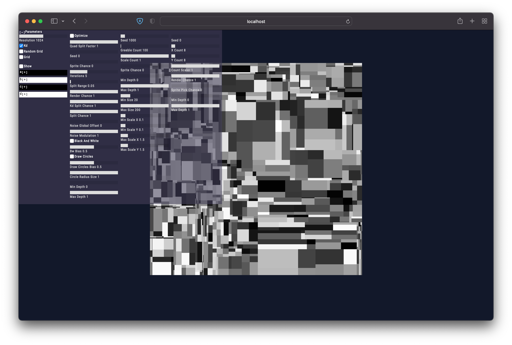

# texgen

**WebGL**-based abstract texture generator for getting gribble-like height maps. Generates height maps and color texture (by using cosine-gradient technique [link](http://www.iquilezles.org/www/articles/palettes/palettes.htm)).

Features react-based UI for setting up controls. 
